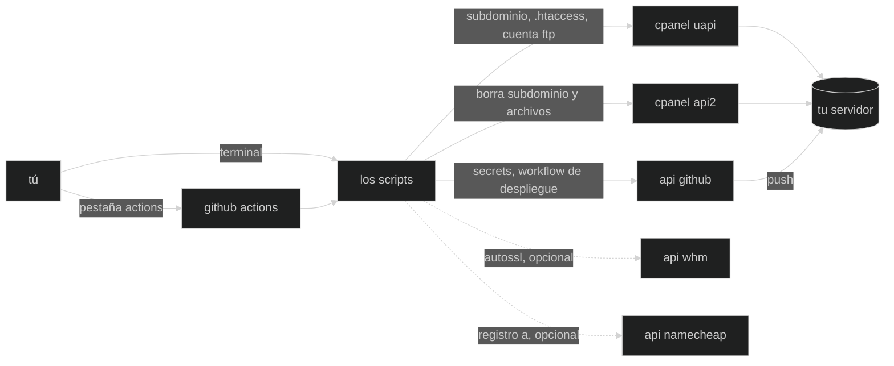

🇬🇧 [English](README.md) · 🇮🇹 [Italiano](README.it.md) · 🇪🇸 Español

# hammerspace

🧰 pequeños scripts que automatizan el trabajo de configuración repetitivo que hago cada vez que pongo en marcha una webapp nueva — dns, hosting, y lo que sea que se gane un sitio aquí con el tiempo.

en la animación, los cómics y los videojuegos, **hammerspace** es ese almacén
extradimensional imaginario del que un personaje saca exactamente la
herramienta que necesita, de la nada, justo en el momento en que la necesita —
[wikipedia cuenta la historia
completa](https://es.wikipedia.org/wiki/Hammerspace), desde los gags de los
looney tunes hasta los fandoms del anime (*urusei yatsura*, *ranma ½*) que
acuñaron el término. [tv
tropes](https://tvtropes.org/pmwiki/pmwiki.php/Main/Hammerspace) tiene un
catálogo más extenso, por si quieres bajar por la madriguera.

la idea aquí es esa: metes la mano, sacas el script adecuado, vuelves a
construir.

## ¿cómo funciona?

un script de python por tarea, que se lanza desde la pestaña actions de github
— sin instalar nada, con las credenciales dentro de los secrets del repo — o
desde una terminal, cuando quieres verlo trabajar.



la división entre las dos apis de cpanel no es una decisión de estilo: uapi
sencillamente no tiene función de borrado, ni para subdominios ni para
archivos — para las cuentas ftp sí la tiene. mira las [notas sobre la api de
cpanel](docs/cpanel-api.md) y las [notas sobre la api de
github](docs/github-api.md).

## herramientas

| herramienta | qué hace |
| --- | --- |
| [`create_subdomain.py`](./create_subdomain.py) | crea un subdominio en cpanel, apunta su document root a `~/<nombre>` y fuerza la redirección https. opcionalmente lanza autossl y crea un registro dns dedicado. también lo borra, con o sin sus archivos. |
| [`setup_autodeploy.py`](./setup_autodeploy.py) | conecta un repo de github con ese subdominio: crea la cuenta ftp, escribe los tres secrets `FTP_*` en el repo de destino y le hace commit de un workflow de despliegue, para que cada push publique. también lo desmonta todo. |

## características

- 🚀 **un clic desde la pestaña actions** — sin checkout, sin python local, las credenciales nunca salen de los secrets del repo
- 🧯 **crear y borrar son workflows separados** — una operación destructiva nunca está a una casilla mal marcada de una rutinaria, y cada uno recibe solo las credenciales que necesita
- ✍️ **para las operaciones destructivas hay que reescribir el nombre** — se comprueba antes incluso de instalar nada
- 🔍 **`--dry-run` en todas partes** — imprime todas las llamadas que haría y de verdad no hace ninguna, ni siquiera de solo lectura
- 🛫 **comprueba antes de escribir** — la ejecución de auto-despliegue verifica repo, rama, workflow y nombre ftp al principio, así un fallo a mitad no deja una cuenta ftp huérfana
- 🔒 **https forzado, ftp cifrado** — un bloque `mod_rewrite` añadido al `.htaccess` del subdominio, y despliegue por ftps en vez del ftp en claro del procedimiento original
- 🗝 **secrets sellados, nunca impresos** — los secrets del repo son sealed boxes de libsodium, y la contraseña ftp generada se queda fuera de los logs salvo que la pidas
- 🗑 **archivos a la papelera por defecto** — recuperables desde el file manager de cpanel; `--purge` cuando de verdad lo quieres
- 🛡 **las rutas se leen, no se adivinan** — la document root viene de cpanel mismo, y se rechaza cualquier ruta fuera del home (o que sea `public_html`)
- 🚫 **no pisa lo que no escribió él** — un `.htaccess` o un workflow de despliegue ya presentes detienen la ejecución en vez de ser reemplazados
- 🌐 **el dns no suele hacer falta** — un registro comodín creado una sola vez hace que cada subdominio resuelva en cuanto existe
- 💥 **falla pronto y en voz alta** — una credencial que falta se anuncia por su nombre, en vez de convertirse más tarde en un error de api incomprensible

## instalación

```bash
python3 -m venv venv
source venv/bin/activate
pip install -r requirements.txt

cp .env.example .env   # pon tus credenciales, nunca subas este archivo
chmod 600 .env         # contiene tokens de api reales
```

la lista completa de credenciales, y los secrets que configurar en github, en
[setup](docs/setup.md).

## uso

desde la pestaña **actions**, o bien:

```bash
python3 create_subdomain.py lab                                # crear
python3 create_subdomain.py lab --dry-run                      # ensayarlo
python3 create_subdomain.py lab --delete                       # borra, conserva los archivos
python3 create_subdomain.py lab --delete --with-files          # + carpeta a la papelera
python3 create_subdomain.py lab --delete --with-files --purge  # + carpeta borrada del todo

python3 setup_autodeploy.py lab --repo tu/lab                  # push y publica
python3 setup_autodeploy.py lab --repo tu/lab --branch web     # desde otra rama
python3 setup_autodeploy.py lab --repo tu/lab --delete         # desmontarlo
```

todos los flags, y lo que hace realmente cada paso, en [uso](docs/usage.md).

## estructura del repo

```
create_subdomain.py       la herramienta de subdominios
setup_autodeploy.py       la herramienta de despliegue desde git
test_*.py                 tests de las funciones puras
.github/workflows/        por herramienta, un workflow para crear y otro para borrar
docs/                     setup, uso, notas de api, resolución de problemas
assets/                   gráficos
```

## documentación

- [setup](docs/setup.md) — credenciales, los niveles de token, los secrets de github, quién puede lanzar qué
- [uso](docs/usage.md) — cada flag y cada input de los workflows, y qué hace realmente una ejecución
- [notas sobre la api de cpanel](docs/cpanel-api.md) — los huecos y las sorpresas que costaron tiempo de verdad
- [notas sobre la api de github](docs/github-api.md) — secrets sellados, el scope que todo el mundo olvida, y por qué un 404 no es una errata
- [resolución de problemas](docs/troubleshooting.md) — qué hacer cuando una ejecución se tuerce

## desarrollo

se trabaja en `develop`; los workflows se ejecutan desde `master`.

```bash
pip install -r requirements-dev.txt
pytest -q
```

los tests cubren las funciones puras — validación del nombre, la guarda sobre
la document root, el parseo de respuestas, la construcción de parámetros dns,
el cifrado de los secrets, el workflow generado — así que se ejecutan sin red
ni credenciales. todo lo que toca una api se comprueba con `--dry-run`.

## licencia

[mit](LICENSE)
