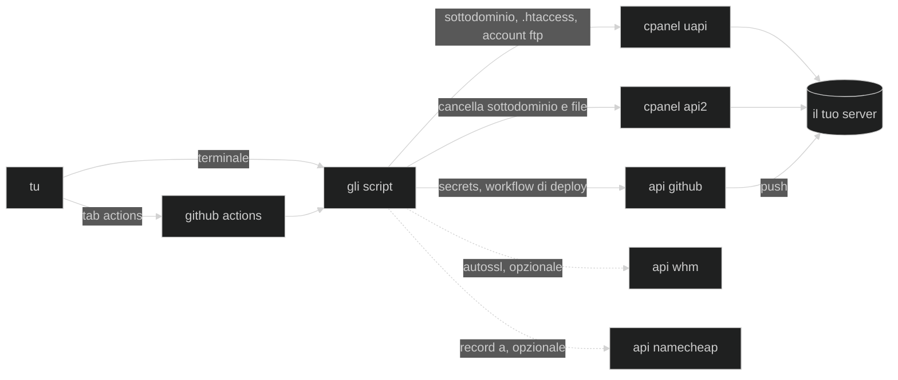

🇬🇧 [English](README.md) · 🇮🇹 Italiano · 🇪🇸 [Español](README.es.md)

# hammerspace

🧰 piccoli script che automatizzano il lavoro di setup ripetitivo che faccio ogni volta che metto online una nuova webapp — dns, hosting, e qualsiasi altra cosa si guadagni un posto qui col tempo.

nei cartoni, nei fumetti e nei videogiochi, **hammerspace** è quel magazzino
extradimensionale immaginario da cui un personaggio tira fuori esattamente
l'attrezzo che gli serve, dal nulla, nel momento esatto in cui gli serve —
[wikipedia ne racconta la storia
completa](https://en.wikipedia.org/wiki/Hammerspace), dalle gag dei looney
tunes ai fandom anime (*lamù*, *ranma ½*) che hanno coniato il termine. [tv
tropes](https://tvtropes.org/pmwiki/pmwiki.php/Main/Hammerspace) ha un
catalogo più approfondito, se ti va di scendere nella tana del bianconiglio.

l'idea qui è quella: infili la mano, tiri fuori lo script giusto, torni a
costruire.

## come funziona?

uno script python per lavoro, azionabile dalla tab actions di github — senza
installare niente, con le credenziali che restano nei secrets del repo — oppure
da terminale, quando vuoi vederlo lavorare.



la divisione fra le due api di cpanel non è una scelta di stile: uapi
semplicemente non ha una funzione di cancellazione, né per i sottodomini né per
i file — ce l'ha invece per gli account ftp. vedi le [note sull'api
cpanel](docs/cpanel-api.md) e le [note sull'api github](docs/github-api.md).

## strumenti

| strumento | cosa fa |
| --- | --- |
| [`create_subdomain.py`](./create_subdomain.py) | crea un sottodominio su cpanel, punta la document root a `~/<nome>` e forza il redirect https. opzionalmente avvia autossl e crea un record dns dedicato. lo cancella anche, con o senza i suoi file. |
| [`setup_autodeploy.py`](./setup_autodeploy.py) | collega un repo github a quel sottodominio: crea l'account ftp, scrive i tre secret `FTP_*` sul repo di destinazione e ci committa un workflow di deploy, così ogni push pubblica. smonta anche tutto quanto. |

## caratteristiche

- 🚀 **un click dalla tab actions** — nessun checkout, nessun python locale, le credenziali non escono mai dai secrets del repo
- 🧯 **creazione e cancellazione sono workflow separati** — un'operazione distruttiva non è mai a una casella spuntata per sbaglio di distanza da una di routine, e ognuno riceve solo le credenziali che gli servono
- ✍️ **per le operazioni distruttive devi riscrivere il nome** — verificato prima ancora che venga installato qualcosa
- 🔍 **`--dry-run` ovunque** — stampa tutte le chiamate che farebbe e non ne fa davvero nessuna, nemmeno in sola lettura
- 🛫 **controlla prima di scrivere** — il run di auto-deploy verifica repo, branch, workflow e nome ftp all'inizio, così un errore a metà non lascia un account ftp orfano
- 🔒 **https forzato, ftp cifrato** — un blocco `mod_rewrite` aggiunto all'`.htaccess` del sottodominio, e deploy via ftps invece dell'ftp in chiaro della procedura originale
- 🗝 **secret sigillati, mai stampati** — i secret del repo sono sealed box libsodium, e la password ftp generata resta fuori dai log se non la chiedi
- 🗑 **file nel cestino per default** — recuperabili dal file manager di cpanel; `--purge` quando lo intendi davvero
- 🛡 **i path si leggono, non si indovinano** — la document root arriva da cpanel stesso, e tutto ciò che sta fuori dalla home (o è `public_html`) viene rifiutato
- 🚫 **non sovrascrive ciò che non ha scritto lui** — un `.htaccess` o un workflow di deploy già presenti fermano il run invece di essere rimpiazzati
- 🌐 **il dns di solito non serve** — un record wildcard creato una volta sola fa risolvere ogni sottodominio nel momento in cui esiste
- 💥 **fallisce presto e a voce alta** — una credenziale mancante si annuncia per nome, invece di trasformarsi in un errore api incomprensibile più avanti

## installazione

```bash
python3 -m venv venv
source venv/bin/activate
pip install -r requirements.txt

cp .env.example .env   # metti le tue credenziali, non committare mai questo file
chmod 600 .env         # contiene token api veri
```

l'elenco completo delle credenziali, e i secrets da configurare su github, in
[setup](docs/setup.md).

## uso

dalla tab **actions**, oppure:

```bash
python3 create_subdomain.py lab                                # crea
python3 create_subdomain.py lab --dry-run                      # provalo a vuoto
python3 create_subdomain.py lab --delete                       # rimuove, tiene i file
python3 create_subdomain.py lab --delete --with-files          # + cartella nel cestino
python3 create_subdomain.py lab --delete --with-files --purge  # + cartella cancellata davvero

python3 setup_autodeploy.py lab --repo tu/lab                  # push e pubblica
python3 setup_autodeploy.py lab --repo tu/lab --branch web     # da un altro branch
python3 setup_autodeploy.py lab --repo tu/lab --delete         # smonta tutto
```

tutti i flag, e cosa fa davvero ogni step, in [uso](docs/usage.md).

## struttura del repo

```
create_subdomain.py       lo strumento per i sottodomini
setup_autodeploy.py       lo strumento per il deploy da git
test_*.py                 test sulle funzioni pure
.github/workflows/        per ogni strumento, un workflow per creare e uno per cancellare
docs/                     setup, uso, note sull'api, risoluzione problemi
assets/                   grafica
```

## documentazione

- [setup](docs/setup.md) — credenziali, i livelli di token, i secrets github, chi può lanciare cosa
- [uso](docs/usage.md) — ogni flag e ogni input dei workflow, e cosa fa davvero un run
- [note sull'api cpanel](docs/cpanel-api.md) — i buchi e le sorprese che sono costati tempo vero
- [note sull'api github](docs/github-api.md) — secret sigillati, lo scope che dimenticano tutti, e perché un 404 non è un errore di battitura
- [risoluzione problemi](docs/troubleshooting.md) — cosa fare quando un run va storto

## sviluppo

si lavora su `develop`; i workflow girano da `master`.

```bash
pip install -r requirements-dev.txt
pytest -q
```

i test coprono le funzioni pure — validazione del nome, guardia sulla document
root, parsing delle risposte, costruzione dei parametri dns, cifratura dei
secret, workflow generato — quindi girano senza rete e senza credenziali.
tutto ciò che tocca un'api si verifica invece con `--dry-run`.

una convenzione da sapere prima di leggere il sorgente: **commenti e docstring
in italiano, tutto quello che vede un utente in inglese.** log, messaggi
d'errore, `--help`, gli input dei workflow nella tab actions e il workflow di
deploy scritto nel tuo repo sono tutti in inglese. l'italiano è l'autore che
ragiona sulla propria infrastruttura, e resta lì.

## licenza

[mit](LICENSE)
