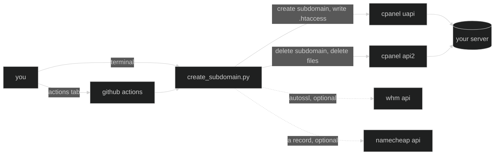

🇬🇧 English · 🇮🇹 [Italiano](README.it.md) · 🇪🇸 [Español](README.es.md)

# hammerspace

🧰 small scripts automating the repetitive setup work i do every time i spin up a new webapp — dns, hosting, and whatever else earns its place here over time.

in animation, comics and video games, **hammerspace** is the imaginary
extradimensional storage that lets a character pull out exactly the tool they
need, out of nowhere, the moment they need it — [wikipedia has the full
history](https://en.wikipedia.org/wiki/Hammerspace), tracing it from looney
tunes gags to the anime fandoms (*urusei yatsura*, *ranma ½*) that coined the
term. [tv tropes](https://tvtropes.org/pmwiki/pmwiki.php/Main/Hammerspace) has a
deeper catalogue if you want to go down that rabbit hole.

that's the idea here: reach in, pull out the right script, get back to building.

## how it works?

one python script per job, driven either from the github actions tab — nothing
installed, credentials living in repository secrets — or from a terminal when
you want to watch it work.



the split between the two cpanel apis isn't a style choice: uapi simply has no
delete function, for subdomains or for files. see [cpanel api
notes](docs/cpanel-api.md).

## tools

| tool | what it does |
| --- | --- |
| [`create_subdomain.py`](./create_subdomain.py) | creates a subdomain on cpanel, points its document root at `~/<name>`, and forces an https redirect. optionally triggers autossl and a dedicated dns record. deletes it again too, with or without its files. |

## features

- 🚀 **one click from the actions tab** — no checkout, no local python, credentials never leave repository secrets
- 🧯 **create and delete are separate workflows** — a destructive run is never one mis-clicked checkbox away from a routine one, and deletion only ever receives the cpanel credentials
- ✍️ **deletion asks you to retype the name** — checked before anything is even installed
- 🔍 **`--dry-run` everywhere** — prints every call it would make and genuinely makes none, not even read-only ones
- 🔒 **forced https** — a `mod_rewrite` block written into the subdomain's `.htaccess`, appended to what's already there rather than replacing it
- 🗑 **files to the trash by default** — recoverable from cpanel's file manager; `--purge` when you really mean it
- 🛡 **paths read, never guessed** — the document root comes from cpanel itself, and anything outside the home directory (or `public_html`) is refused
- 🌐 **dns usually unnecessary** — a one-time wildcard record means every subdomain resolves the moment it exists
- 💥 **fails loudly and early** — a missing credential names itself instead of turning into a confusing api error later

## setup

```bash
python3 -m venv venv
source venv/bin/activate
pip install -r requirements.txt

cp .env.example .env   # fill in your own credentials, never commit this file
chmod 600 .env         # it holds live api tokens
```

full credential list, and the github secrets to configure, in
[setup](docs/setup.md).

## usage

from the **actions** tab, or:

```bash
python3 create_subdomain.py lab                                # create
python3 create_subdomain.py lab --dry-run                      # rehearse it
python3 create_subdomain.py lab --delete                       # remove, keep the files
python3 create_subdomain.py lab --delete --with-files          # + folder to the trash
python3 create_subdomain.py lab --delete --with-files --purge  # + folder gone for good
```

every flag, and what each step actually does, in [usage](docs/usage.md).

## repository layout

```
create_subdomain.py       the tool
test_create_subdomain.py  tests for the pure functions
.github/workflows/        one workflow to create, one to delete
docs/                     setup, usage, api notes, troubleshooting
assets/                   art
```

## docs

- [setup](docs/setup.md) — credentials, the two token levels, github secrets, who can run what
- [usage](docs/usage.md) — every flag and workflow input, and what a run actually does
- [cpanel api notes](docs/cpanel-api.md) — the gaps and surprises that cost real time to find
- [troubleshooting](docs/troubleshooting.md) — what to do when a run goes sideways

## development

work happens on `develop`; `master` is what the workflows run from.

```bash
pip install -r requirements-dev.txt
pytest -q
```

the tests cover the pure functions — name validation, the document-root safety
guard, response parsing, dns parameter construction — so they run without
network or credentials. anything touching an api is exercised with `--dry-run`
instead.

## license

[mit](LICENSE)
