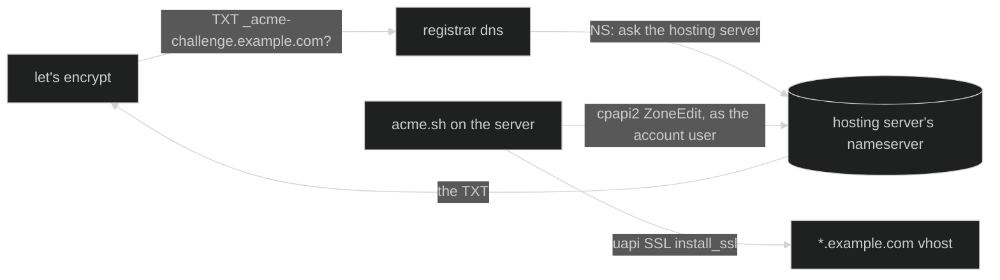

# wildcard certificate

a real let's encrypt certificate for `*.example.com`, issued and renewed from
inside a cpanel account, validated through the account's own dns zone.
nothing on the registrar is touched after a one-time record, and no api token
is stored on the server.

the files live in [`acme/`](../acme): a dns hook for
[acme.sh](https://github.com/acmesh-official/acme.sh) and a setup script. both
run **on the server**, as the cpanel user.

## why you'd want one

with a wildcard `*` dns record pointing at the server (see [usage](usage.md)),
every name under the domain resolves — including ones cpanel knows nothing
about. an undefined name falls through to the shared server's **default
virtual host**: on shared hosting that's somebody else's site, usually with a
certificate for the wrong name. deleting a subdomain turns its old address into
exactly that.

the fix is a catch-all subdomain `*` in cpanel whose document root only
redirects:

```apache
RewriteEngine On
RewriteRule ^\.well-known/ - [L]
RewriteRule ^ https://example.com/ [R=302,L]
```

302, not 301 — browsers cache a 301, so a name someone once visited would keep
redirecting even after a real subdomain is created for it.

that fixes what visitors see, but https still needs a certificate for
`*.example.com`, and that's what this page is about.

## why not autossl, why not the registrar's api

- **autossl can't.** let's encrypt only issues wildcards through dns
  validation, and autossl only does dns validation for zones the server is
  authoritative for. with dns at the registrar it refuses with *"DNS DCV: No
  local authority"* — and it keeps refusing even with the delegation below,
  because it checks the whole domain, not the challenge name.
- **the registrar's api is the wrong tool for this job.** acme.sh's namecheap
  plugin validates with `getHosts` + `setHosts`, and `setHosts` **replaces the
  entire zone**: twice per renewal, every sixty days, it rewrites every record
  the domain has. it doesn't resend the email-forwarding setting, and it can't
  preserve a record's dynamic-dns flag. it also needs a whitelisted, fixed
  client ip — and namecheap only grants api access to accounts that meet its
  spending requirements in the first place.

## how it works



1. **one record at the registrar**: `NS _acme-challenge → <the hosting server's
   nameserver>`. only that name is delegated; everything else stays where it
   is. cpanel already keeps a copy of the domain's zone on the server, and the
   server's nameserver answers for it — check with
   `dig +norec @<nameserver> example.com SOA`.
2. **the hook** (`dns_cpanel_local.sh`) adds and removes the challenge TXT in
   that local zone through the `cpapi2` command-line tool. run as the account
   user, `cpapi2` needs no token — which is the point: the official
   `dns_cpanel` plugin would need an api token stored in the account.
3. **acme.sh** issues the certificate and installs it with its `cpanel_uapi`
   deploy hook, then renews it from a daily cron job.

## setting it up

you need: the `*` catch-all subdomain from above, cron, and `git`, `curl`,
`openssl`, `perl`, `uapi` and `cpapi2` on the server (all standard on cpanel).

1. add the `NS` record for `_acme-challenge` at the registrar, then check that
   public resolvers reach the server's zone:

   ```bash
   dig +short TXT _acme-challenge.example.com @1.1.1.1
   ```

   no answer is fine at this point; an error or `SERVFAIL` isn't.

2. upload `acme/dns_cpanel_local.sh` and `acme/setup_wildcard_certificate.sh`
   to one folder in the account, e.g. `~/acme-setup/`.

3. run the rehearsal against let's encrypt's staging ca — it uses a separate
   folder, so it never touches the real certificate's configuration:

   ```bash
   sh ~/acme-setup/setup_wildcard_certificate.sh example.com staging
   ```

4. then the real one:

   ```bash
   sh ~/acme-setup/setup_wildcard_certificate.sh example.com production
   ```

   it issues the certificate, installs it on the `*.example.com` vhost only,
   excludes that name from autossl, and prints the renewal cron line.

5. add that line in cpanel → cron jobs. it runs daily and only renews when
   let's encrypt's renewal window opens (roughly every sixty days).

the script pins acme.sh to a release **and** checks the commit it checked out,
since that code runs with access to the account and its dns zone. each mode
leaves a `.done-<mode>` marker next to the script so it never runs twice;
delete the marker to run that mode again.

### without ssh

many shared accounts have no shell. a cron entry is one, though: add a
temporary job that runs every minute, wait for its log, remove the job. through
the api:

```
GET /json-api/cpanel?...&cpanel_jsonapi_module=Cron&cpanel_jsonapi_func=add_line
  &command=/bin/sh /home/<user>/acme-setup/setup_wildcard_certificate.sh example.com staging >> /home/<user>/acme-setup/staging.log 2>&1
  &minute=*&hour=*&day=*&month=*&weekday=*
```

read the log with `Fileman::get_file_content`, then `Cron::remove_line` with
the `linekey` that `add_line` returned. the script's marker and lock keep the
extra runs harmless.

**never put a `%` in a cron command.** cron turns it into a newline and feeds
the rest of the line to the command's stdin, so the job silently does
something else. write anything that needs `printf` into a script and call that.

## the trap: the deploy hook's auto mode

`cpanel_uapi` defaults to **auto mode**: it installs the certificate on every
vhost the certificate covers. a wildcard covers every subdomain — so the first
deploy replaces **all** of their autossl certificates with the wildcard. nothing
breaks right away, but every site now depends on one renewal instead of
autossl.

the setup script deploys with `DEPLOY_CPANEL_AUTO_ENABLED=false` (classic mode:
only the `*.example.com` vhost), and acme.sh saves that choice in the
certificate's configuration, so it holds for every renewal. check it any time:

```bash
grep DEPLOY_CPANEL ~/.acme.sh/'*.example.com'/'*.example.com.conf'
# SAVED_DEPLOY_CPANEL_AUTO_ENABLED='false'
```

if a deploy already went wide, the subdomains' previous autossl certificates
are still in the account's certificate store: reinstall each one with
`SSL::install_ssl` and the swap is atomic. see [cpanel api
notes](cpanel-api.md#restoring-a-certificate-from-the-store) for pairing a
certificate with its key.

## the other trap: cpanel's service subdomains lose autossl

cpanel answers `cpanel.`, `webmail.`, `webdisk.`, `cpcalendars.`,
`cpcontacts.`, `autoconfig.` and `autodiscover.example.com` itself (its "proxy
subdomains"), and autossl adds them to the main domain's certificate. to prove
control it writes the challenge file into the **main** document root,
`~/public_html/.well-known/acme-challenge/`.

once the `*` catch-all exists, plain-http requests for those names reach the
catch-all's virtual host instead, served from **its** document root. the
challenge file isn't there, the 404 page falls into the catch-all's redirect,
and autossl receives the homepage. it gives up with *"The response exceeded
the maximum length (16 KB)"* in cpanel → SSL/TLS Status, and the next renewal
drops those names from the main certificate. https is unaffected, which is why
the sites themselves look fine.

the fix is to point the catch-all's challenge folder at the main one:

```bash
mkdir -p ~/<catch-all docroot>/.well-known
ln -sfn ~/public_html/.well-known/acme-challenge ~/<catch-all docroot>/.well-known/acme-challenge
```

the catch-all's `.htaccess` already lets `.well-known/` through, and the
wildcard certificate itself validates over dns, so nothing else reads that
folder. without a shell, run it as a one-off cron job the same way as the setup
script above. check it by dropping a file in
`~/public_html/.well-known/acme-challenge/` and fetching
`http://cpanel.example.com/.well-known/acme-challenge/<file>`: it must return
the file, not a redirect.

## when something's off

- **renewal:** `renew-last-run.log` next to the script holds the last cron
  run. `acme.sh --list` shows the next renewal date.
- **validation fails:** check the delegation still answers —
  `dig TXT _acme-challenge.example.com @1.1.1.1` must come back without error.
  a resolver that cached the old TXT set can hide a brand-new value for up to
  the record's ttl; rerunning later is usually enough.
- **worst case**, the certificate expires: only the catch-all shows a warning.
  real subdomains have their own autossl certificates and aren't affected.
